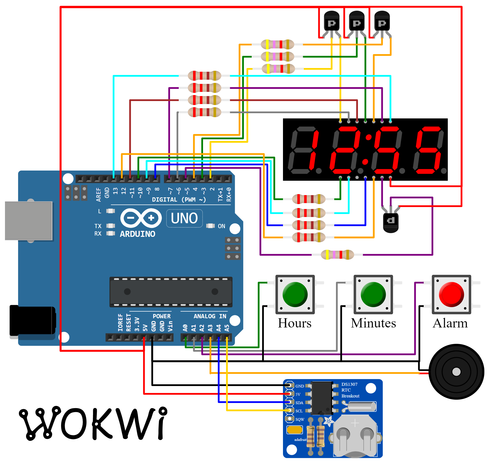

This digital alarm clock displays the time on a 4-digit 7-segment display. It has the following features:

- Two buttons for setting the current time (Hour / Minute)
- Programable alarm with a snooze function
- The alarm sound can be easily customized in code, and even play melodies
- The colon symbol blinks to indicate seconds
- Optional [RTC](https://en.wikipedia.org/wiki/Real-time_clock) to make the clock more accurate
- Power loss recovery: current time and alarm settings are stored in RTC

### How to use the clock

To set the time, press the _Minute_/_Hour_ buttons.

Pressing the _Alarm_ button enables/disables the alarm. The screen will display the alarm state by showing the word "on" or "off".

After enabling the alarm, the current alarm time will be displayed for a few seconds. You can use the _Minute_/_Hour_ buttons to adjust the alarm time. To finish, press the _Alarm_ button again, or just wait a few seconds.

When the alarm goes off, press the _Alarm_ button briefly to snooze it for
[9 minutes](https://mashable.com/article/everything-you-need-to-know-about-snooze-button-alarm-clocks/). The screen will display four circles to let you know that the alarm was snoozed.

To stop the alarm, hold down the _Alarm_ button for one second or more.

### Project Structure

The code is divided into several modules:

1. [config.h](#source-config_h) - Configuration options for the clock: whether to use an RTC chip, Snooze time, and more. Using a configuration file a common practice when you have several modules in your program.
2. [alarm-clock.ino](#source-alarm_clock_ino) - The main program code. It manages the user interface: the 7-segment display and the buttons.
3. [Clock](#source-clock_h) - The `Clock` class manages the current time and the alarm state machine. It uses the [RTClib](https://github.com/adafruit/RTClib) library to communicate with the RTC chip and track time.
4. [AlarmTone](#source-clock_h) - The `AlarmTone` class play the alarm sound. You can change the values of the `TONES` array, `TONE_TIME` and `TONE_SPACING` to customize the alarm and play different tones and melodies.

### Hardware

| Item              | Quantity | Notes                                 |
| ----------------- | -------- | ------------------------------------- |
| Arduino Uno R3    | 1        |                                       |
| 4-Digit 7-Segment | 4        | Common Anode, 14 pins                 |
| 220Ω Resistor     | 8        | Connect to the 7-segment segment pins |
| PNP Transistor    | 4        | Optional, recommended                 |
| 4.7kΩ Resistor    | 4        | If you use the PNP transistors        |
| 12mm Push button  | 3        |                                       |
| Piezo Buzzer      | 1        | Used for the alarm                    |
| DS1307 RTC        | 1        | Optional                              |

- You can also use a Common Cathode 7-segment display, just adjust the `DISPLAY_TYPE` constant in [config.h](#source-config_h), and switch to NPN transistors.

To keep the clock hardware down to minimum, the Arduino controls the 7-Segment display directly, using the [SevSeg](https://www.arduinolibraries.info/libraries/sev-seg) library.
This approach as a downside, however: it uses 12 GPIO pins!

If you want to save on Arduino pins, you can use a _74HC595_ shift register to cut the pin usage down to 6, or even a 7-Segment display with an integrated controller chip, such as
_TM1637_, _HT16K33_, or _MAX7219_. In this case, you will need to change the code to use a different display library (_SevSeg_ does not support this case), but this is out of the scope of this project.

### Diagram

<figure>
    
    <figcaption>Arduino Safe Connection Diagram</figcaption>
</figure>

### Pin Connections

| Arduino Uno Pin | Device           | Device Pin |
| --------------- | ---------------- | ---------- |
| 2               | 7-Segment        | 14 (Dig 1) |
| 3               | 7-Segment        | 11 (Dig 2) |
| 4               | 7-Segment        | 10 (Dig 3) |
| 5               | 7-Segment        | 6 (Dig 4)  |
| 6               | 7-Segment        | 13 (A)     |
| 7               | 7-Segment        | 9 (B)      |
| 8               | 7-Segment        | 4 (C)      |
| 9               | 7-Segment        | 2 (D)      |
| 10              | 7-Segment        | 1 (E)      |
| 11              | 7-Segment        | 12 (F)     |
| 12              | 7-Segment        | 5 (G)      |
| 13              | 7-Segment        | 8 (Colon)  |
| A0              | Hour Button      | -          |
| A1              | Minute Button    | -          |
| A2              | Alarm Button     | -          |
| A3              | Buzzer / Speaker | -          |
| A4              | DS1307 RTC       | SDA        |
| A5              | DS1307 RTC       | SCL        |

- The pin numbers for your 7-segment display may differ. Please consult the datasheet relevant to your device to find out the relevant pin numbers.
