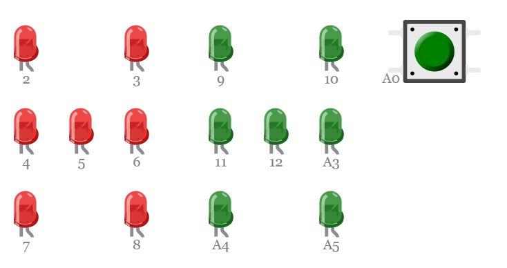
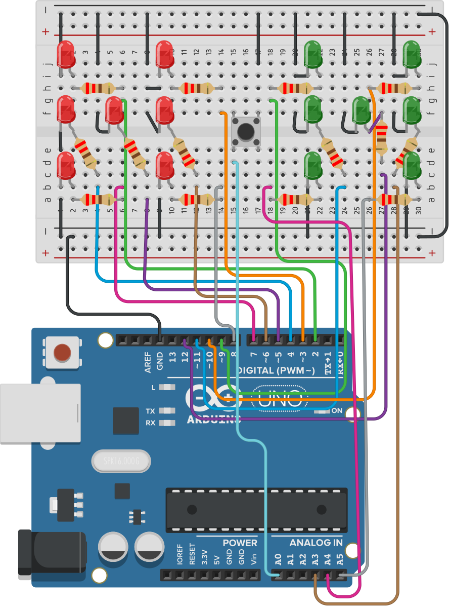

A digital dice roller, controlled by Arduino. Each dice is represented by 7 LEDs
that are arranged according to standard [dice pip pattern](<https://en.wikipedia.org/wiki/Pip_(counting)>).

There are two dice and one button. Pressing the button rolls the dice, displays a sequence
of random numbers, followed by the result.

The LEDs are connected to the Arduino pins
as follows:

### Hardware

| Item             | Quantity | Notes         |
| ---------------- | -------- | ------------- |
| Arduino Uno R3   | 1        |               |
| 5mm LED          | 14       | Red and Green |
| 12mm Push button | 1        |               |
| Resistor         | 14       | 220Ω          |

### Diagram

<figure>
    
    <figcaption>Simon connection diagram</figcaption>
</figure>
