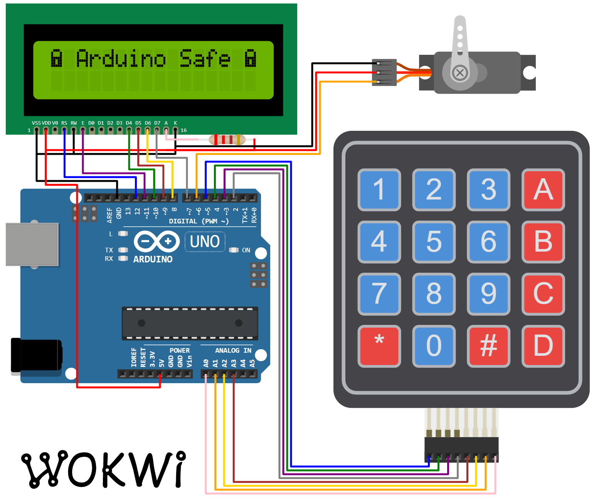

This project implements an electronic safe, powered by an Arduino Uno.

The safe has three main components:
An [16x02 LCD Monitor](https://wokwi.com/playground/lcd1602)
and a [Membrane Keypad](https://wokwi.com/playground/keypad) for the
user interface, and a Servo motor that powers the lock mechanism.

The state of the safe (locked/unlocked), as well as the secret code
are stored in the Arduino's [EEPROM](https://wokwi.com/playground/eeprom), so
the code isn't wiped even when the power goes off.

### Code Structure

The code is divided into three modules:

- [electronic-safe.ino](#source-electronic_safe_ino) - Main program code, including the user interface
- [icons.cpp](#source-icons_cpp) - Provides the locked/unlocked icon for the LCD screen
- [SafeState.cpp](#source-safestate_cpp) - Manages the state of the safe and the secret code, and stores them in the EEPROM memory.

### Hardware

| Item            | Quantity | Notes                          |
| --------------- | -------- | ------------------------------ |
| Arduino Uno R3  | 1        |                                |
| Membrane KeyPad | 1        |                                |
| LCD1602         | 1        |                                |
| Servo motor     | 1        | You can use a solenoid instead |

### Diagram

<figure>
    
    <figcaption>Arduino Safe Connection Diagram</figcaption>
</figure>

### Pin Connections

| Arduino Pin | Device | Device Pin |
| ----------- | ------ | ---------- |
| 12          | LCD    | RS         |
| 11          | LCD    | Enable     |
| 10          | LCD    | D4         |
| 9           | LCD    | D5         |
| 8           | LCD    | D6         |
| 7           | LCD    | D7         |
| 6           | Servo  | Signal     |
| 5           | Keypad | R1         |
| 4           | Keypad | R2         |
| 3           | Keypad | R3         |
| 2           | Keypad | R4         |
| A3          | Keypad | C1         |
| A2          | Keypad | C2         |
| A1          | Keypad | C3         |
| A0          | Keypad | C4         |
