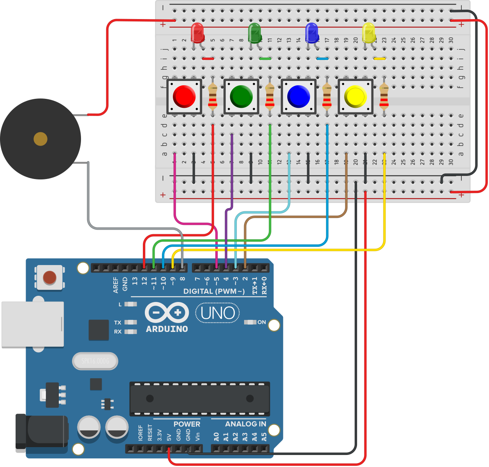

Simon is a simple electronic memory game: the user has to repeat a growing sequence of
colors. The sequence is displayed by lighting up the LEDs. Each color also has a
corresponding tone.

In each turn, the game will play the sequence, and then wait for the user to repeat
the sequence by pressing the buttons according to the color sequence. If the user
repeated the sequence correctly, the game will play a "leveling-up" sound, add a new
color at the end of the sequence, and move to the next turn.

The game continues until the user has made a mistake. Then a game over sound is
played, and the game restarts.

### Hardware

| Item             | Quantity | Notes                        |
| ---------------- | -------- | ---------------------------- |
| Arduino Uno R3   | 1        |                              |
| 5mm LED          | 4        | Red, Green, Blue, and Yellow |
| 12mm Push button | 4        | Red, Green, Blue, and Yellow |
| Resistor         | 4        | 220Ω                         |
| Piezo Buzzer     | 1        |                              |

<figure>
    
    <figcaption>
      Hardware for the Simon game, 
      <a href="https://www.tindie.com/products/wokwi/kit-for-simon-style-game-arduino-shield/" target="_blank">
        kit available on Tindie
      </a>
    </figcaption>
</figure>

### Diagram

<figure>
    
    <figcaption>Simon connection diagram</figcaption>
</figure>

### Pin Connections

| Arduino Pin | Device        |
| ----------- | ------------- |
| 12          | Red LED       |
| 11          | Green LED     |
| 10          | Blue LED      |
| 9           | Yellow LED    |
| 8           | Buzzer        |
| 5           | Red Button    |
| 4           | Green Button  |
| 3           | Blue Button   |
| 2           | Yellow Button |

- The LEDs are connected through a 220Ω resistor each.
